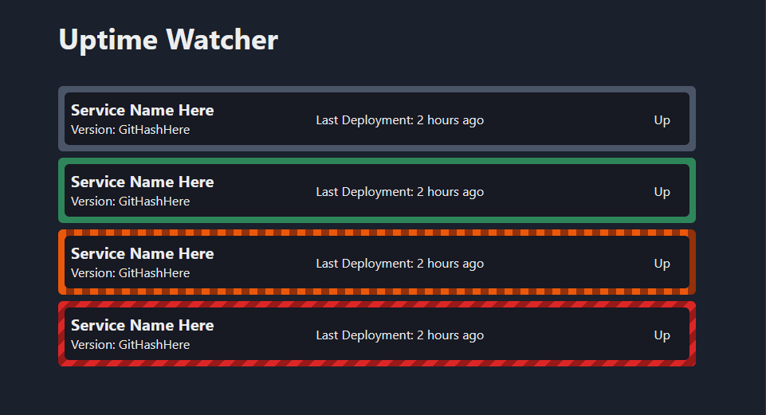

# Uptime Watcher POC

_Yarn Workspaces Mono Repo_

Simple little web application with the task of viewing real time the status of all microservices in a given environment



### Running Locally

**In the root directory**

1. Install deps

```bash
yarn install
```

2. Running the backend

```bash
TBD
```

3. Running the frontend

```bash
dev:frontend
```

cleaning local env

```bash
yarn clean
```

### Running Tests

**TBD**

### Stack

- React
- AWS lambda with API Gateway
- Ansible
